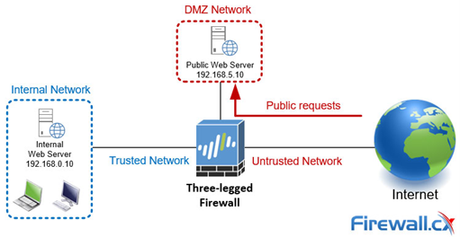
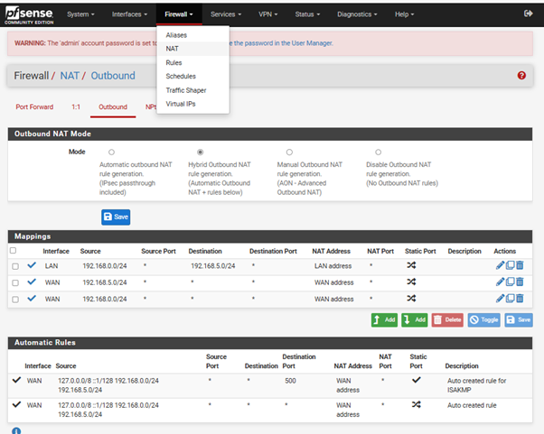
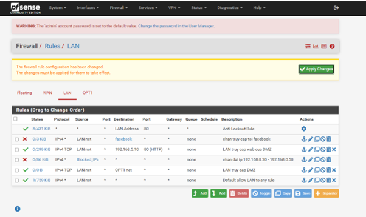

# XÂY DỰNG HỆ THỐNG MẠNG THREE-LEGGED FIREWALL VỚI PFSENSE

## 📖 Giới thiệu
Dự án triển khai mô hình tường lửa 3 chân (Three-Legged Firewall) sử dụng nền tảng mã nguồn mở pfSense. Mục tiêu cốt lõi là thiết lập các khu vực mạng cách ly an toàn bao gồm mạng nội bộ (Internal), vùng DMZ và Internet, từ đó phân tách rõ ràng luồng truy cập và bảo vệ cơ sở hạ tầng mạng khỏi các rủi ro xâm nhập.

## 🛡️ Tổng Quan Về Mô Hình Three-Legged Firewall
[cite_start]Mô hình tường lửa ba chân là một hệ thống bảo mật quan trọng giúp bảo vệ cơ sở hạ tầng mạng của tổ chức bằng cách cách ly mạng nội bộ và vùng DMZ khỏi sự truy cập không mong muốn từ Internet[cite: 199]. 

[cite_start]Hệ thống hoạt động dựa trên việc phân chia và kiểm soát luồng dữ liệu giữa ba vùng mạng[cite: 223]:
* [cite_start]**Internet (Mạng toàn cầu):** Mạng công cộng không được tin cậy, yêu cầu biện pháp bảo vệ vững chắc để ngăn ngừa các cuộc tấn công[cite: 212, 214].
* [cite_start]**DMZ (Demilitarized Zone):** Khu vực trung gian giữa mạng nội bộ (LAN) và Internet, thường chứa các dịch vụ công cộng như web server, mail server[cite: 215]. [cite_start]DMZ giúp cô lập các tài nguyên công khai khỏi mạng nội bộ, đảm bảo kết nối từ bên ngoài không thể xâm nhập vào mạng nội bộ[cite: 216].
* [cite_start]**Internal Network (Mạng nội bộ):** Mạng riêng của tổ chức, lưu trữ dữ liệu nhạy cảm và hệ thống nội bộ[cite: 218]. [cite_start]Vùng này yêu cầu mức độ bảo mật cao và chỉ cho phép truy cập từ các nguồn tin cậy bên trong hoặc từ DMZ thông qua quy tắc nghiêm ngặt[cite: 219].

**Ưu điểm nổi bật:**
* [cite_start]**Phân đoạn mạng:** Cách ly mạng nội bộ và DMZ khỏi mạng ngoài internet, làm cho kẻ tấn công khó tiếp cận hệ thống nhạy cảm[cite: 240].
* [cite_start]**Kiểm soát lưu lượng chi tiết:** Thiết lập chính sách bảo mật nghiêm ngặt, chỉ cho phép lưu lượng cần thiết giữa DMZ và mạng nội bộ[cite: 241].
* [cite_start]**Vùng đệm an toàn:** DMZ hoạt động như một vùng đệm cho phép dịch vụ công khai tương tác với internet mà không làm lộ mạng nội bộ[cite: 243].

## 🏗️ Kiến Trúc Hệ Thống (Network Architecture)

Hệ thống được thiết kế với 3 vùng mạng độc lập, tuân thủ nguyên tắc quyền tối thiểu (principle of least privilege):
1. **Internet (WAN):** Nhận IP thông qua DHCP (Ví dụ: `10.10.10.128/24`).
2. **DMZ (Demilitarized Zone):** Chứa Public Web Server (`192.168.5.10/24`). 
3. **Internal Network (LAN):** Gồm máy trạm (`192.168.0.10/24`) và máy client (`192.168.0.25/24`). 

## ⚙️ Các Chức Năng Đã Triển Khai

Hệ thống sử dụng tường lửa pfSense với các tính năng định tuyến và kiểm soát truy cập chi tiết:

* **Network Address Translation (NAT):** Cấu hình Hybrid Outbound NAT để dịch địa chỉ IP nội bộ, ẩn hoàn toàn mạng LAN và máy chủ DMZ khỏi mạng bên ngoài.
  
  

* **Firewall Aliases:** Tạo tập hợp định danh để quản lý rule gọn gàng, bao gồm dải IP bị chặn (`Blocked_IPs`: 192.168.0.20 - 192.168.0.50) và tên miền mạng xã hội (`facebook.com`).
* **Firewall Rules:**
  * **WAN:** Chặn mạng Bogon (IP rác) và chỉ cho phép lưu lượng HTTP (Port 80) truy cập vào Web Server tại DMZ.
  * **LAN:** Cho phép người dùng truy cập web tại DMZ và đi ra Internet, nhưng chặn tuyệt đối các dải IP và tên miền đã định nghĩa (như Facebook).
  
  

  * **DMZ:** Chặn hoàn toàn lưu lượng khởi tạo từ DMZ truy cập ngược vào mạng LAN để bảo vệ tài nguyên nội bộ phòng trường hợp Web Server bị tấn công.
